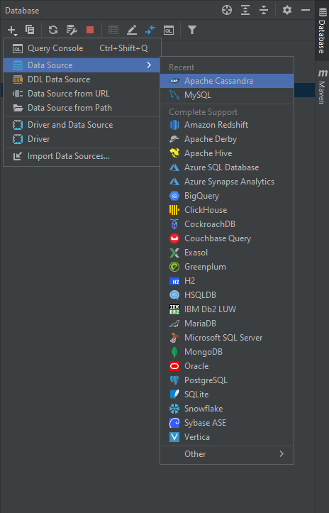
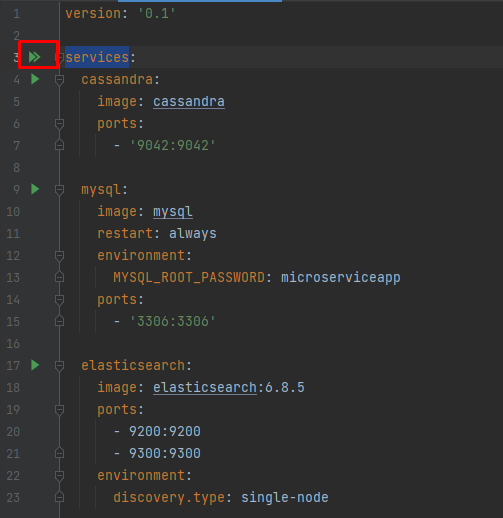

# MicroServiceApp

Kullanım için bilgisayarınız docker kurulumu olması gerekmektedir.
https://www.docker.com/products/docker-desktop

Daha sonrasında ana dizindeki docs klasörü altındaki docker-compose.yml çalıştırılmalıdır.

### Cassandra Database Bilgileri:
username : cassandra
password : cassandra

### Cassandra Database Oluşturma:
CREATE KEYSPACE innovation
WITH replication = {'class':'SimpleStrategy', 'replication_factor' : 3};

### MYSQL Database Bilgileri:
username: root
password: microserviceapp

### MYSQL Database Oluşturma:
create database innovation;

